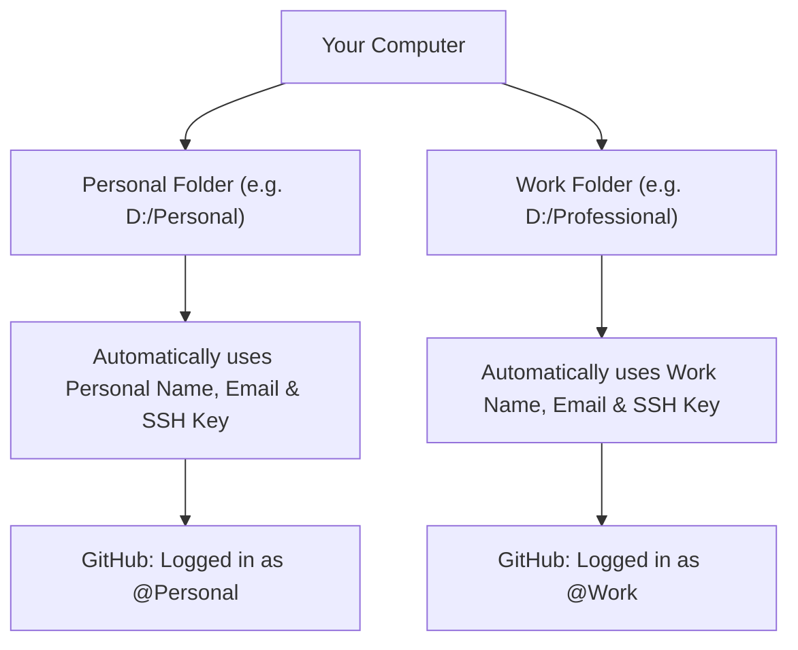

# 🐙 GitHub Multi-Account Manager

A simple, secure desktop application for **Windows**, **macOS**, and **Linux** that lets you use multiple GitHub accounts (like **Personal** and **Work**) on the same computer without ever switching accounts manually.

---

## 📦 Download App

Automated releases are built for every operating system:

| Operating System | Download Link | Format | Instructions |
| :--- | :--- | :--- | :--- |
| **Windows (x64)** 🪟 | [**Download for Windows (zip)**](https://github.com/Optirius/github-multi-account-manager/releases/latest/download/github-account-manager-windows-x64.zip) | Portable `.zip` with `.exe` | Unzip and double-click `github-account-manager.exe` |
| **macOS (Intel & Apple Silicon)** 🍎 | [**Download for macOS (zip)**](https://github.com/Optirius/github-multi-account-manager/releases/latest/download/github-account-manager-macos.zip) | `.app` application bundle | Unzip and move to `/Applications` |
| **Linux (x64)** 🐧 | [**Download for Linux (tar.gz)**](https://github.com/Optirius/github-multi-account-manager/releases/latest/download/github-account-manager-linux-x64.tar.gz) | Standalone Linux binary | Extract and run `./github-account-manager` |

---

## 💡 How It Works

Instead of constantly changing your Git settings or logging in and out, you simply organize your projects into separate folders:



* Work on a project in your **Personal** folder &rarr; Git commits as **Personal**.
* Work on a project in your **Work** folder &rarr; Git commits as **Work**.
* **You never have to switch accounts by hand again.**

---

## ❓ Why You Need This App

| Without This App ❌ | With This App ✅ |
| :--- | :--- |
| **Email Leaks**: Your personal email accidentally ends up on company commits (or work email on open-source repos). | **Automatic Email Routing**: Git always uses the exact email assigned to that folder. |
| **Editor Mix-ups**: VS Code, JetBrains Rider, Visual Studio, or Cursor tries to use the wrong GitHub login and gives `Permission Denied` errors. | **1-Click Editor Fix**: Prevents code editors from overriding your folder accounts. |
| **Manual Typing**: Having to type `git config user.email` for every new repository. | **Zero Effort**: Every new repo in the folder inherits the right account instantly. |
| **Office Wi-Fi Blocks**: Office or hotel networks blocking standard SSH port 22. | **Works Everywhere**: Automatically includes fallback to port 443 so pushes always work. |

---

## 🚀 Easy 5-Step Setup

Setting up takes less than 2 minutes:

### 1. 👤 Add Accounts
* Click **`+ Add Account`** to create your profiles (e.g. `Personal` and `Work`).
* Enter your **Name** and **Commit Email** for each.

### 2. 🔑 Create SSH Keys
* Click **`+ Generate SSH Key`** to make a secure key for each profile.
* Click **`📋 Copy Key`**, open [GitHub SSH Settings](https://github.com/settings/keys) in your browser, and paste the key.
* Click **`⚡ Test Connection`** to verify it connects.

### 3. 📁 Choose Folders
* Click **`+ Map Directory`** to link your folders:
  * `D:/Personal` &rarr; Assigned to **Personal**
  * `D:/Professional` &rarr; Assigned to **Work**

### 4. 🧩 External Apps & IDEs
* Click **`⚡ Apply Isolation to All IDEs`** so VS Code, Rider, Visual Studio, and Cursor use the right folder identity.
* Click **`🚀 Convert All Repos to SSH`** so your projects use SSH key authentication cleanly.

### 5. 🔍 Check with Inspector
* Select any repository or folder to double-check that Git will use the right name, email, and SSH key.

---

## ⚡ How You Work Every Day

Once you finish setup, you don't need to keep the app open:

1. Put personal projects in your **Personal** folder.
2. Put work projects in your **Work** folder.
3. Commit and push normally from terminal, VS Code, Rider, or any GUI:
   ```bash
   git add .
   git commit -m "Add new feature"
   git push origin main
   ```
4. Git will automatically use the right author name, email, and SSH key every single time!

---

## 🛠️ Supported Tools & Editors

The app automatically detects installed development tools on Windows, macOS, and Linux:
* **Code Editors & IDEs**: Visual Studio (2022/2026), JetBrains Rider, IntelliJ IDEA, PyCharm, WebStorm, CLion, GoLand, Visual Studio Code, Cursor AI, Windsurf, VSCodium.
* **Git GUI Clients**: GitHub Desktop, GitKraken, SourceTree, Sublime Merge.
* **OS Credential Stores**: Windows Credential Manager, macOS Apple Keychain, Linux Secret Service / libsecret.

---

## 💻 Developer & Build Instructions

If you want to build or run the source code locally:

```bash
# 1. Clone repository
git clone https://github.com/Optirius/github-multi-account-manager.git
cd github-multi-account-manager

# 2. Install dependencies with uv
uv sync

# 3. Run application
uv run python main.py

# 4. Run tests
uv run pytest

# 5. Build standalone release bundle
uv run python build.py
```

---

## 📄 License
MIT License &copy; 2026 Optirius. Free for personal and commercial use.