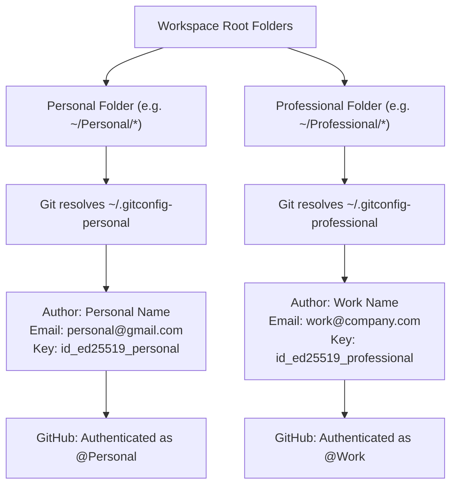

# 🐙 GitHub Multi-Account Manager

A secure, modern desktop GUI application built with **Python 3.12+**, **uv**, and **CustomTkinter** that automates multiple GitHub accounts across different directories (e.g., `Personal`, `Work`, `Freelance`, or `Client` projects) on **Windows**, **macOS**, and **Linux**.

Eliminates cross-account permission collisions, IDE account hijacking (VS Code, Cursor, Windsurf), and corporate firewall blocks without requiring any manual account switching or personal access tokens.

---

## 📦 Download Releases

Automated cross-platform releases are built and published on every push to `main`. Download the standalone bundle for your operating system:

| Operating System | Download Package | Format | Notes |
| :--- | :--- | :--- | :--- |
| **Windows (x64)** 🪟 | [**github-account-manager-windows-x64.zip**](https://github.com/Optirius/github-multi-account-manager/releases/latest/download/github-account-manager-windows-x64.zip) | Portable `.zip` with `.exe` | Unzip and launch `github-account-manager.exe` |
| **macOS (Universal)** 🍎 | [**github-account-manager-macos.zip**](https://github.com/Optirius/github-multi-account-manager/releases/latest/download/github-account-manager-macos.zip) | Standalone macOS bundle | Supports Apple Silicon (M1/M2/M3) & Intel |
| **Linux (x64)** 🐧 | [**github-account-manager-linux-x64.tar.gz**](https://github.com/Optirius/github-multi-account-manager/releases/latest/download/github-account-manager-linux-x64.tar.gz) | Executable `.tar.gz` archive | Compatible with Ubuntu, Debian, Fedora & Arch |

---

## 🤔 Do You Need This Application?

If you manage more than one GitHub account on the same computer (such as a **Personal** account and a **Work/Company** account), you have likely run into these frustrating problems:

| The Problem (Without This App) ❌ | The Solution (With This App) ✅ |
| :--- | :--- |
| **Email Leakage**: Your personal email accidentally shows up in corporate/client commits (or your work email leaks into your open-source projects). | **Automated Routing**: Git natively detects the folder and automatically uses the exact author name and commit email assigned to that workspace. |
| **IDE Account Hijacking**: You are logged into VS Code with your work GitHub account, and VS Code tries to use those credentials on personal repos, causing `Permission Denied (publickey)` or `403 Forbidden`. | **1-Click IDE Isolation**: Automatically configures VS Code, Cursor, and Windsurf to respect folder boundaries and stops editor accounts from interfering with Git. |
| **Manual Switching Fatigue**: Constantly running `git config user.email` or switching profiles every time you switch repositories. | **Zero Manual Switching**: Place personal projects in `D:/Personal` and work projects in `D:/Professional`. You never switch accounts again. |
| **Firewall & ISP Port 22 Blocks**: SSH connections fail because corporate Wi-Fi or ISPs block standard port 22 (`Connection closed by port 22`). | **Port 443 Fallback**: Automatically configures SSH to route securely over GitHub's official port 443 endpoint (`ssh.github.com:443`). |
| **Confusing SSH Alias Hacks**: Needing to rewrite clone URLs to `git clone git@github-personal:owner/repo.git`. | **Standard Universal Remotes**: Standard `git clone git@github.com:...` works everywhere out of the box. |

---

## 🌟 The Core Concept: Zero-Switching Architecture

This application does **not** require you to select an account from a dropdown every time you work. Instead, it uses Git's native **Conditional Include (`includeIf`)** and OpenSSH architecture:



1. You assign root workspace directories (e.g. `Personal` and `Professional`) to account profiles once during setup.
2. Whenever you run `git commit` or `git push` inside any repository in your personal directory, Git dynamically resolves `~/.gitconfig-personal` and signs commits with your personal identity.
3. Whenever you work inside your professional directory, Git dynamically resolves `~/.gitconfig-professional` and signs commits with your work identity.
4. **You never switch accounts manually.**

---

## 🚀 5-Step Setup Walkthrough (Addressing Each Tab)

Setting up your system takes less than 2 minutes using the application's step-by-step tabs:

### 1. 👤 Accounts & Profiles Tab
* **What to do**: Click **`+ Add Account`** to create your identity profiles (e.g. `Personal` and `Professional`).
* **Settings configured**:
  * **Profile Label**: Friendly name (e.g. `Personal`, `Work`).
  * **Git Author Name (`user.name`)**: Your public name for commits.
  * **Git Commit Email (`user.email`)**: The verified commit email for that account.
  * **Linked SSH Key**: Select the corresponding private key from `~/.ssh/`.

### 2. 🔑 SSH Keys Tab
* **What to do**:
  * Click **`+ Generate SSH Key`** to generate high-security **ED25519** key pairs for any profile that doesn't have one yet.
  * Click **`📋 Copy Key`** on the generated key card.
  * Open [GitHub SSH Settings](https://github.com/settings/keys) in your browser and paste the public key.
  * Click **`⚡ Test Connection`** to verify live authentication with GitHub.

### 3. 📁 Directory Mappings Tab
* **What to do**: Click **`+ Map Directory`** to link your workspace root folders to their respective account profile:
  * `Personal Folder` &rarr; Assigned to **Personal**
  * `Work Folder` &rarr; Assigned to **Professional**
* **Result**: All existing and future repositories inside these folders automatically inherit the account profile.

### 4. 🧩 External Apps & IDE Isolation Tab
* **What to do**:
  * Click **`⚡ Apply Isolation to All IDEs`**: Configures installed code editors (VS Code, Cursor AI, Windsurf, VSCodium) with `github.gitAuthentication: false` so they don't hijack your Git operations with the editor's logged-in account.
  * Click **`🚀 Convert All HTTPS Repos to SSH`**: Scans your mapped folders and converts any HTTPS remotes to standard `git@github.com:...` remotes for clean key authentication.
  * Click **`🗑️ Clear Global Credentials`**: Deletes conflicting global tokens from the OS credential store (Windows Vault, macOS Keychain, Linux Secret Service).

### 5. 🔍 Git & Directory Inspector Tab
* **What to do**: Select or browse to any repository or folder on your computer.
* **Verification**: The inspector simulates and displays the exact **Author Name**, **Email**, and **SSH Command** Git will resolve, and lets you test live SSH connectivity with 1 click.

---

## ⚡ Daily Workflow: How You Work Going Forward

Once the initial setup is complete, you **do not** need to keep the app open:

1. **Personal Projects**: Clone or create projects in your Personal directory.
2. **Work Projects**: Clone or create projects in your Work directory.
3. **Commit & Push Normally**:
   ```bash
   git add .
   git commit -m "feat: implement new feature"
   git push origin main
   ```
4. Git and OpenSSH automatically apply the right commit author and authenticate with the right SSH key without any prompts or manual intervention.

---

## 🏗️ Modular Cross-Platform Architecture

```
github-multi-account-manager/
├── .github/workflows/
│   └── release.yml              # Multi-OS CI/CD automated release pipeline
├── pyproject.toml               # uv project configuration and dependencies
├── build.py                     # Standalone PyInstaller builder & compressor
├── README.md                    # Project documentation & guide
├── main.py                      # Application entry point
├── src/
│   └── github_account_manager/
│       ├── config.py            # App paths, directories, and constants
│       ├── models.py            # Pydantic schemas (Account, FolderMapping, SSHKeyInfo)
│       ├── platform/            # 🌐 Modular OS Adapters
│       │   ├── __init__.py      # Platform factory (get_platform_adapter)
│       │   ├── base.py          # PlatformAdapter abstract interface
│       │   ├── windows.py       # Windows adapter (cmdkey, AppData, Registry)
│       │   ├── macos.py         # macOS adapter (Keychain, ~/Library, /Applications)
│       │   └── linux.py         # Linux adapter (secret-tool, ~/.config, /usr/bin)
│       ├── services/
│       │   ├── git_service.py   # Git config includeIf, ~/.ssh/config & backups
│       │   ├── ssh_service.py   # SSH key generation, discovery & live testing
│       │   ├── github_service.py# GitHub REST API public profile lookup
│       │   ├── app_integration_service.py # Cross-platform IDE isolation & scanner
│       │   └── manager.py       # Core orchestrator coordinating state & sync
│       └── ui/
│           ├── app.py           # Main CustomTkinter desktop window & navigation
│           ├── async_runner.py  # Non-blocking async background executor with loaders
│           ├── theme.py         # Cross-platform color palettes, fonts & themes
│           ├── components/      # UI components (Cards, Badges, Modals, InfoBanners)
│           │   ├── account_card.py
│           │   ├── folder_row.py
│           │   ├── info_banner.py
│           │   ├── status_badge.py
│           │   └── dialogs.py   # SSH guides, Deletion guard & Error modals
│           └── views/           # Guide, Accounts, Folders, SSH, Apps, Inspector, Settings
└── tests/                       # Complete pytest test suite (24 unit tests)
```

---

## 🚀 Development & Local Run

### Prerequisites
- **Python 3.12+**
- [**uv**](https://docs.astral.sh/uv/) (recommended) or `pip`
- **Git** & **OpenSSH**

### Quickstart

1. **Clone the repository:**
   ```bash
   git clone https://github.com/Optirius/github-multi-account-manager.git
   cd github-multi-account-manager
   ```

2. **Run with `uv`:**
   ```bash
   uv run github-account-manager
   ```

3. **Run Test Suite:**
   ```bash
   uv run pytest
   ```

4. **Build Local Binary Package:**
   ```bash
   uv run python build.py
   ```

---

## 🛡️ Security & Privacy

* **100% Tokenless**: Works entirely through dedicated SSH key pairs. No Personal Access Tokens (PATs) or passwords are stored.
* **Atomic File Writes**: All configuration files (`~/.gitconfig`, `~/.ssh/config`, `~/.gitconfig-*`) are written using atomic file replacement to eliminate corruption risk.
* **Strict Key Isolation**: Enforces `IdentitiesOnly yes` in `~/.ssh/config` and Git configuration to prevent cross-account key leakage.

---

## 📄 License

This project is licensed under the [MIT License](LICENSE).